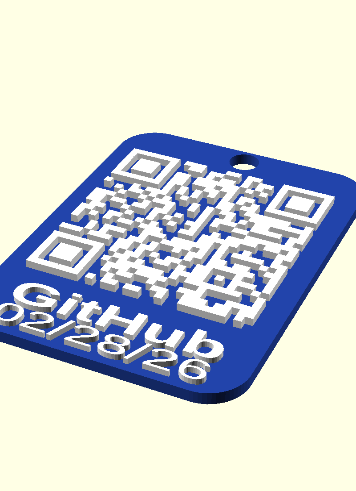

# qrcode-3d-print

Two-color 3D-printable QR code hang tag generator.

<p align="center">
  
  
</p>

Produces two STL files sharing the same coordinate system -- import both into your slicer and assign different filament colors:

- `output_base.stl` -- tag body (Color 1)
- `output_qr.stl` -- QR blocks + label text (Color 2)

Example STLs are in [`examples/`](examples/).

## Usage

```
uv run generate_qr.py
```

Put the text to encode in `input.txt` (or use `--text`). Edit `config.toml` to taste.

Requires Python 3.11+, [uv](https://github.com/astral-sh/uv), and [OpenSCAD](https://openscad.org/).

## Config

All settings live in `config.toml`. CLI flags override config values.

```toml
[tag]
width  = 68.8        # mm (height is auto-derived from content)
thickness = 3.0      # base plate thickness
padding = 2.0        # uniform gap around all content
round_corners = true
corner_radius = 10.0

[qr]
qr_thickness = 2.0       # raised height of QR blocks
quiet_zone_blocks = 2    # spec=4; 2 works on modern scanners
deboss = false            # recess QR into tag instead of raising

[hole]
enabled = true
radius  = 4.0
x       = 0.0            # horizontal offset from center

[label]
text = "1Pass"
date = "02/26/26"        # or "today" for auto
size = 8.0               # font size
height = 1.5             # raised height of label text
```

Tag height is auto-derived from content. Use `--height` on the CLI to force a specific height.

Label text is horizontally stretched to 80% of the tag width and centered. The stretch factor is set in `gen_label()` in `generate_qr.py`.

## How it works

Python computes all positions as absolute mm coordinates and writes minimal `.scad` files with everything baked in as literals. OpenSCAD is used purely as a geometry renderer -- no variables or positioning logic in the `.scad`.

Pipeline: config + input text -> QR matrix -> layout math -> `.scad` files -> OpenSCAD -> STL.

## Credits

QR matrix generation uses the [qrcode](https://github.com/lincolnloop/python-qrcode) Python library.

Inspired by [QR Code Generator for Customizer](https://www.thingiverse.com/thing:46884) by laird on Thingiverse. This project is a full rewrite with a different architecture.
